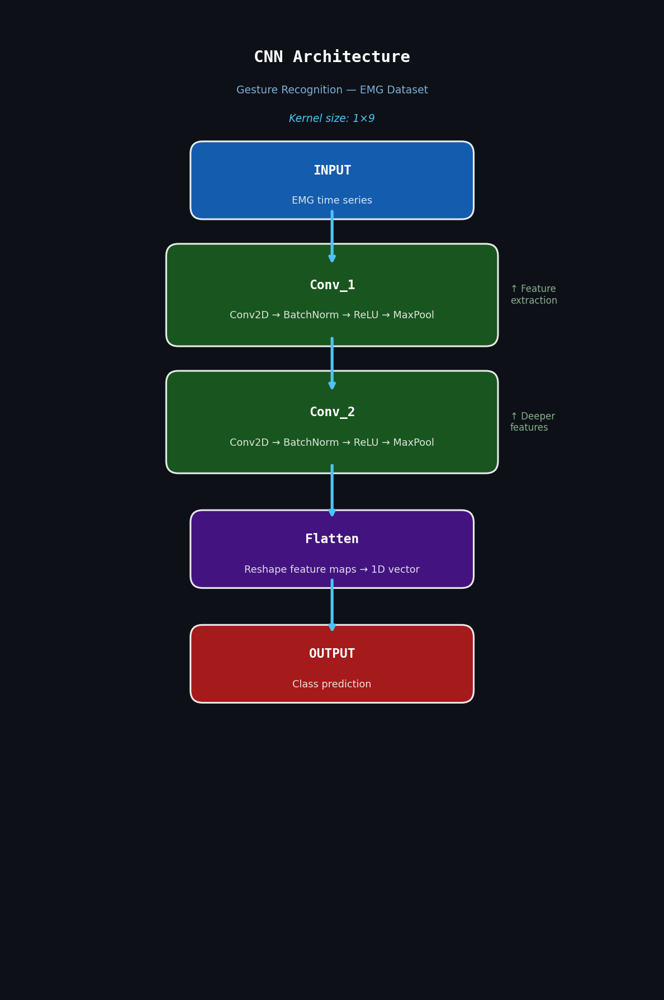
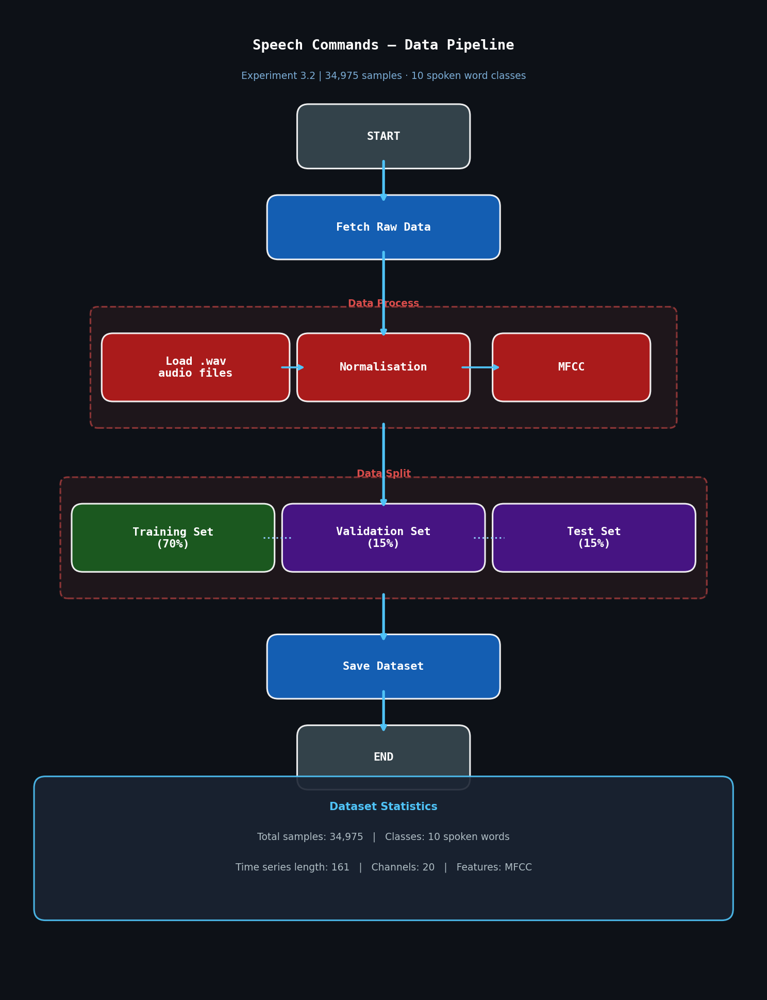

# Experimental Results & Observations

## Experiment 3.1 — Gesture Recognition (EMG Dataset)

### Setup

- Dataset: EMG (Electromyography) — cross-people task
- Model: CNN skeleton with kernel size 1x9 (Conv2D → BatchNorm → ReLU → MaxPool × 2 → Flatten → Output)
- Algorithm: Diversify with 10 latent domains

### Results

| Method | Target 0 | Target 1 | Target 2 | Target 3 | AVG |
|--------|----------|----------|----------|----------|-----|
| ERM | 62.6 | 69.9 | 67.9 | 69.3 | 67.4 |
| DANN | 62.9 | 70.0 | 66.5 | 68.2 | 66.9 |
| CORAL | 66.4 | 74.6 | 71.4 | 74.2 | 71.7 |
| GroupDRO | 67.6 | 77.4 | 73.7 | 72.5 | 72.8 |
| AdaRNN | 68.8 | 81.1 | 75.3 | 78.1 | 75.8 |
| **DIVERSIFY (paper, PyTorch 1.7.1)** | **71.7** | **82.4** | **76.9** | **77.3** | **77.1** |
| **DIVERSIFY (this code, PyTorch 1.13.1)** | **73.1** | **86.8** | **80.4** | **81.6** | **80.5** |
| **DIVERSIFY (this code, tuned)** | **78.67** | **85** | **76.14** | **74.787** | **78.64** |

### Observations

- Our reproduction using PyTorch 1.13.1 **exceeded the paper's reported results** (80.5% avg vs 77.1%), likely due to improvements in the newer PyTorch version's optimisation behaviour.
- After tuning hyperparameters (learning rate, epochs, alpha values), we achieved an average accuracy of **78.64%**, with a peak of **85%** on Target 1.
- Diversify consistently outperformed all baseline methods (ERM, DANN, CORAL, Mixup, GroupDRO, RSC, ANDMask, AdaRNN), confirming the paper's central claim that latent domain diversification improves OOD generalisation.
- The improvement over ERM (+11 points avg) demonstrates the value of explicit OOD representation learning for time series classification tasks.

---

## Experiment 3.2 — Speech Commands Dataset

### Setup

- Dataset: SpeechCommand subset — 34,975 time series samples across 10 spoken word classes
- Time series length: 161 with 20 channels (after MFCC feature extraction)
- Data split: 70% training / 15% validation / 15% test

### Reproducibility Challenge

The original paper only open-sourced code for the EMG dataset. The Speech Commands experiment required a second processing step (MFCC feature extraction, normalisation) for which the final input data format and shape were not documented.

We investigated the GitHub issues page of the original repository and found that the authors acknowledged only supporting one dataset publicly. We also contacted the authors directly by email requesting the complete preprocessing code — we did not receive a response.

As a result, we were unable to fully reproduce Experiment 3.2, despite our efforts to reverse-engineer the preprocessing pipeline.

### Takeaway

This experience highlighted a common challenge in ML research reproducibility: incomplete open-source releases can make it difficult or impossible to reproduce all reported results, even when the core algorithm is publicly available. This is an active discussion in the research community around reproducibility standards.

---

## Summary

| Experiment | Status | Notes |
|------------|--------|-------|
| 3.1 Gesture Recognition (EMG) | ✅ Reproduced & exceeded | Results surpassed paper with PyTorch 1.13.1 |
| 3.2 Speech Commands | ⚠️ Partially attempted | Blocked by incomplete open-source release |
